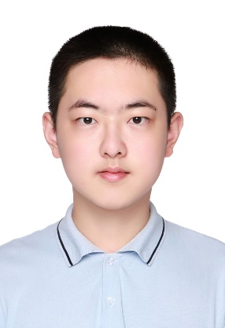

# YIXIN WAN

*Currently applying for Master's or PhD programs.*

**Shanghai Jiao Tong University, Global College — Electronic and Computer Engineering**

Phone: 177-1736-6933 ｜ Email: <wanyixin0125@sjtu.edu.cn>

---

## Education

**Shanghai Jiao Tong University, Global College** ｜ B.Eng. in Electronic and Computer Engineering ｜ `Sep. 2023 – Present`

**Core Courses:**

  
  
  
    Mathematics \&amp; Physics  
    <ul>  
      <li>Honors Calculus II</li>  
      <li>Honors Calculus III</li>  
      <li>Honors Calculus IV</li>  
      <li>Discrete Mathematics</li>  
      <li>Probabilistic Methods in Engineering</li>  
      <li>Physics I</li>  
      <li>Physics II</li>  
      <li>Modern Physics</li>  
    </ul>  
  
  
  
  
    Computing \&amp; Programming  
    <ul>  
      <li>Introduction to Computers and Programming</li>  
      <li>Programming and Introductory Data Structures</li>  
      <li>Data Structures and Algorithms</li>  
      <li>Introduction to Computer Organization</li>  
      <li>Introduction to Cryptography</li>  
    </ul>  
  
  
  
  
    Circuits, Signals \&amp; Systems  
    <ul>  
      <li>Introduction to Circuits</li>  
      <li>Electronic Circuits</li>  
      <li>Digital Integrated Circuits</li>  
      <li>Introduction to Logic Design</li>  
      <li>Electromagnetics I</li>  
      <li>Introduction to Signals and Systems</li>  
      <li>Introduction to Engineering</li>  
      <li>Semiconductor Design</li>  
    </ul>  
  
  
  
  
    Communication \&amp; Writing  
    <ul>  
      <li>Academic Writing</li>  
      <li>Technical Communication</li>  
      <li>Advanced Technical Communication</li>  
    </ul>  
  
  

## Publications

1. **Yixin Wan**, Xubin Mao, Lanqing Yang. *TrustCTR: Target-Side Trustworthy Multimodal Enhancement for Click-Through Rate Prediction.* The 22nd International Conference on Advanced Data Mining and Applications (ADMA 2026). **Accepted.** Mainly responsible for method design and manuscript writing.
2. Nan Fang, Yanting Zhang, **Yixin Wan**, et al. *GSBridge: Bridging Sparse Geometry and Semantic Consistency in Text-to-3D Generation.* The 22nd International Conference on Advanced Data Mining and Applications (ADMA 2026). **Accepted.** Mainly responsible for the English manuscript writing.
3. Siying Li, Jingyi Guo, **Yixin Wan**, et al. *Structured Diffusion for Controlled Text Synthesis on Garments.* Pacific Rim International Conference on Artificial Intelligence (PRICAI 2026). **Accepted.** Mainly responsible for the English manuscript writing.

## Research & Project Experience

### 1. Trustworthy Multimodal Enhancement for Click-Through Rate Prediction

Research Group of Assoc. Prof. Lanqing Yang (SJTU) & Prof. Yanting Zhang(DHU) ｜ `Mar. 2026 – Aug. 2026`

- Studied multimodal CTR prediction, where inconsistent and noisy image, text and ID signals degrade target item representations. Under the guidance of Assoc. Prof. Lanqing Yang, proposed a target-side trustworthy enhancement framework that takes the ID representation as a stable behavioral backbone and adaptively regulates multimodal fusion through confidence gating.
- Took main responsibility for the research design and implementation: developed the confidence-gating mechanism together with the supporting modules (multimodal interest synergy, structured semantic matching and cross-view contrastive learning), implemented the complete model in PyTorch, and conducted comparative experiments against 15 conventional, sequential and multimodal baselines on three Amazon datasets, where the model achieved the best AUC.
- Extended the method to a real-world waterfall-style recommendation scenario and built a lightweight variant for deployment-constrained settings, verifying its transferability and engineering feasibility.
- As first author, took main responsibility for the research work and the complete manuscript, accepted by ADMA 2026. In addition, served as a third author on two collaborative papers on text-to-3D generation and controllable garment text synthesis, mainly handling the English writing and editing under the guidance of Prof. Yanting Zhang.

### 2. Non-Intrusive Online Condition Monitoring for Large-Scale Laboratory Equipment

Research Group of Prof. Guangtao Xue & Assoc. Prof. Lanqing Yang, SJTU ｜ `Sep. 2025 – Feb. 2026`

- Participated in developing a low-cost, non-intrusive online condition-monitoring system for large laboratory equipment such as ultra-high-speed centrifuges, addressing limitations of manual inspection and native device interfaces.
- Deployed integrated sensors for magnetic-field, acceleration, temperature and humidity; constructed signal acquisition pipelines. Determined optimal sensor mounting positions via spatial magnetic-field scanning, and maintained background data-acquisition scripts.
- Conducted Power Spectral Density (PSD) analysis on magnetic-field signals from centrifuges. Designed operational/standby classification rules based on amplitude ratios between the 50 Hz power-frequency main peak and high-frequency characteristic peaks.
- Collected thousands of data samples across three devices over half a month. Implemented the full pipeline including sensor sampling, data acquisition, status classification and frontend visualization, delivering reusable acquisition and decision-making modules for follow-up group research.

### 3. LLM-Driven Virtual Deform Simulation Engineer Agent System

Beijing Institute of Mechanical and Electrical Technology, CAM (Internship Project) ｜ `Aug. 2025 – Sep. 2025`

- Built a large-model-driven agent to tackle high-operation barriers and lack of public APIs for the Deform simulation software. Combined natural-language parsing and computer-vision-based UI localization to automate end-to-end simulation workflows: DB-file generation, parameter configuration and simulation computation.
- Completed requirement analysis independently and developed full-stack agent modules: implemented dual-backend LLM interfaces (OpenRouter cloud + local Ollama) to translate natural-language instructions into standardized JSON action sequences; built desktop-control modules with PyAutoGUI; developed a two-stage UI matching scheme (coarse parent-graph matching + fine child-graph alignment) using OpenCV and PIL, and accumulated over 50 UI template screenshots.
- Implemented a dual-mode execution architecture: AI dynamic parsing plus predefined workflow templates. Integrated safety mechanisms including manual mouse emergency interruption, pre-execution confirmation and human fallback for recognition failures. Validated automation feasibility for professional simulation software through prototyping and demo, and delivered a reusable engineering-simulation agent control framework.

### 4. IoT-based Pet-care & Interaction System

Course Project, Introduction to Engineering ｜ `Jun. 2024 – Aug. 2024`

- Constructed an IoT pet-care system on the ESP32 embedded platform with 3D-printed mechanical structures, supporting remote monitoring, remote feeding and laser-based pet interaction.
- Set up cloud server and configured intranet penetration to establish public-network data links for ESP32-CAM, enabling real-time Web-based video surveillance.
- Took part in hardware-software joint debugging and functional testing; realized linkage among laser tracking, video streaming and feeding modules. Authored technical reports and deliverables, and delivered project presentation in English.

## Technical Skills & Language Proficiency

|                             |                                                                                                                                                                                                                                                  |
| --------------------------- | ------------------------------------------------------------------------------------------------------------------------------------------------------------------------------------------------------------------------------------------------ |
| **Programming & Tools**     | C, C++, Python, MATLAB, Verilog; VS Code, PyCharm, OpenCV, PIL, PyAutoGUI, Ollama, OpenRouter API                                                                                                                                                |
| **Engineering & Analytics** | LLM-based Agent development, LLM API integration, visual UI-location automation, predefined workflow design, sensor deployment & data acquisition, power-spectral-density analysis, IoT system joint debugging, Linux background task management |
| **English**                 | TOEFL: 110/120 (Listening 6/6); CET-6: 614 (Reading 245/249); CET-4: 639 (Listening 249/249). Proficient at reading academic papers, composing English manuscripts and delivering academic presentations in English.                             |

## Campus & International Experience

- **Military Training Squad Leader**　`Aug. 2023 – Sep. 2023`  
  Coordinated squad training, dormitory administration and personnel arrangement to ensure smooth military-training activities; strengthened organizational skills and sense of responsibility.
- **Class Life Committee Member**　`Sep. 2023 – Sep. 2025`  
  Collected and addressed classmates' daily-life demands, supported class operations and enhanced group cohesion; improved communication and problem-solving capabilities.
- **Spain Winter Exchange Program**　`Jan. 2025 – Feb. 2025`  
  Completed coursework in Web Development and Spanish. Collaborated within a team to finish full-cycle design, coding and testing for an obstacle-avoidance game. Enhanced cross-cultural communication and global-mindset awareness.
- **Cultural-creativity-driven Rural Revitalization Field Survey on Yu-Shan Island, Fujian**　`Aug. 2024`  
  Conducted on-site field research; communicated with local government, folk-culture organizations and Tsinghua University rural-revitalization research center. Summarized transformation paths for island cultural-creativity industries, applying technical insights to real-world rural-revitalization scenarios.

## Self-Assessment {#self}

Sincere, modest and collaborative. Diligent, pragmatic and challenge-oriented in academic studies. Strong team-player awareness and sense of responsibility, consistently holds high personal standards.
